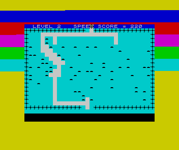
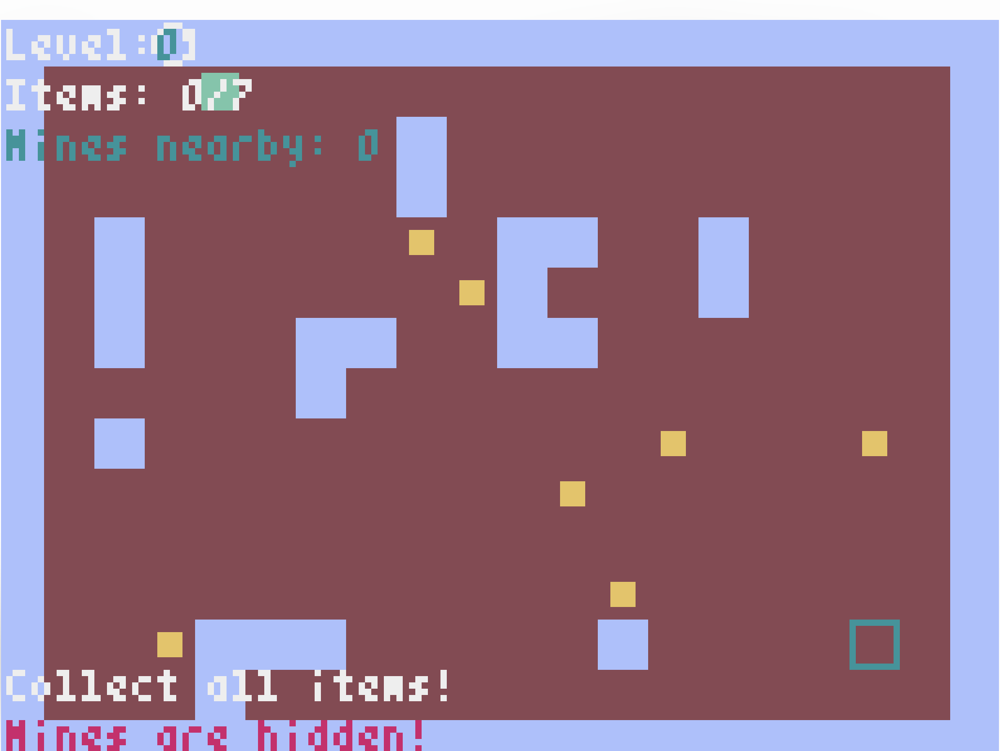

# Mined-Out

A Pyxel port of the classic retro puzzle game Mined-Out.

## About the Original Game

Mined-Out is a maze video game created by Ian Andrew originally for the ZX Spectrum home computer in 1983. The objective is to carefully navigate a series of grid-shaped minefields by moving from the bottom to the top of the screen. The number of invisible mines in spaces adjacent to the player's current position is shown but not their precise location, requiring deduction to advance past them and avoid getting blown up.

Stuart Campbell of Your Sinclair listed the game as the 97th best Spectrum game of all time in 1991, citing its core logic gameplay as "one of the greatest mind-teasers ever devised."


### Game Description

#### Original looked like that:



The core gameplay revolves around logical deduction:
- Navigate from the bottom to the top of grid-based minefields
- Numbers indicate how many mines are adjacent to your current position
- Use deduction to determine safe paths and avoid hidden mines
- Additional challenges are introduced in later stages

You may think of a game as pre-Minesweeper, which uses cursor instead of the mouse clicking, and player should go through the field instead of finding each non-mined cell.

#### Be aware port is not ready and looks like that



It should become closer and closer to the original every day!


### Progressive Difficulty

As you advance through levels, new challenges emerge:
- **Level 3**: Introduction of a "Mine Spreader" that relocates mines
- **Level 4**: "The Bug" begins stalking you through your path
- **Level 6**: Your revealed path disappears behind you

## About This Port

This version recreates the classic Mined-Out experience using [Pyxel](https://github.com/kitao/pyxel), a retro game engine for Python. The port maintains the original's strategic gameplay while leveraging Pyxel's modern capabilities for cross-platform compatibility.

## Installation

### Prerequisites

- (poetry)[https://python-poetry.org]

### Install the Game

```bash
git clone https://github.com/vlnn/mined_out
cd mined_out
poetry install
```

### Run the Game

```bash
poetry run mined_out
```

## How to Play

### Controls

- **Arrow Keys**: Move your character through the minefield
- **Q**: Quit the game
- **R**: Restart current level (if implemented)

### Gameplay Tips

1. **Study the Numbers**: Each number tells you how many mines are adjacent (including diagonally)
2. **Start Safe**: Begin from areas with low numbers to establish safe zones
3. **Use Logic**: If a "1" has already revealed one mine nearby, the other adjacent spaces are safe
4. **Plan Your Route**: Think several moves ahead to avoid getting trapped
5. **Take Your Time**: There's no time pressure (until The Bug appears!)

### Winning Strategy

- Use the process of elimination to deduce mine locations
- Mark suspected mine locations mentally or on paper
- Work systematically from known safe areas
- Remember that mines are invisible until you deduce their locations

## Development

This project demonstrates:
- **Faithful Recreation**: Preserving the original game's strategic depth
- **Modern Framework**: Utilizing Pyxel's retro-inspired design
- **Cross-Platform**: Runs on Windows, macOS, Linux, and web browsers
- **Clean Code**: Following Python best practices and modular design

### Project Structure

```
mined_out/
├── mined_out.py          # Main game file
├── assets/               # Game assets (sprites, sounds)
├── README.md            # This file
└── requirements.txt     # Python dependencies
```

## Features

- ✅ Classic minefield navigation gameplay
- ✅ Progressive difficulty across multiple levels
- ✅ Retro pixel-art aesthetic
- ✅ Cross-platform compatibility
- 🔄 Sound effects and music (in development)
- 🔄 High score tracking (planned)

## Technical Details

### Built With

- **Python**: Primary programming language
- **Pyxel**: Retro game engine providing 16-color graphics and 4-channel audio
- **Logical Design**: Grid-based movement and mine detection algorithms

### Game Engine Features

Pyxel provides the perfect foundation for recreating this classic:
- 16-color palette matching retro aesthetics
- Simple API for rapid development
- Built-in sprite and sound editors
- Cross-platform deployment options

## Contributing

Contributions are welcome! Areas for improvement:

1. **Sound Design**: Adding authentic retro sound effects
2. **Visual Polish**: Enhancing sprites and animations
3. **Additional Features**: High scores, level editor, multiplayer modes
4. **Testing**: Cross-platform compatibility testing
5. **Documentation**: Code comments and development guides

### Development Setup

```bash
# Clone the repository
git clone https://github.com/vlnn/mined_out.git
cd mined_out

# Install dependencies
pip install pyxel

# Run in development mode
python mined_out.py
```

## License

This project is open source. Please respect the intellectual property of the original Mined-Out game.

## Acknowledgments

- **Ian Andrew**: Creator of the original Mined-Out (1983)
- **Quicksilva Ltd**: Original publisher
- **Takashi Kitao**: Creator of the Pyxel game engine
- **ZX Spectrum Community**: For preserving retro gaming history


